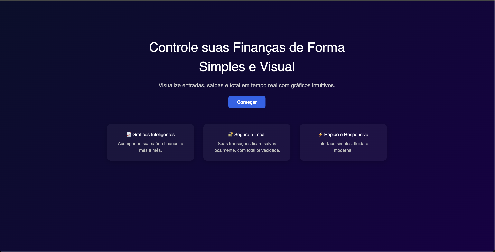
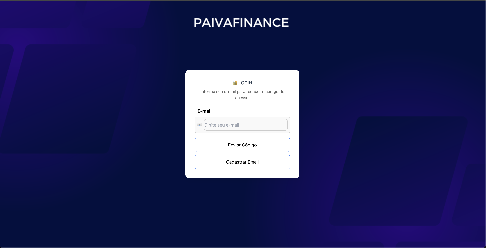
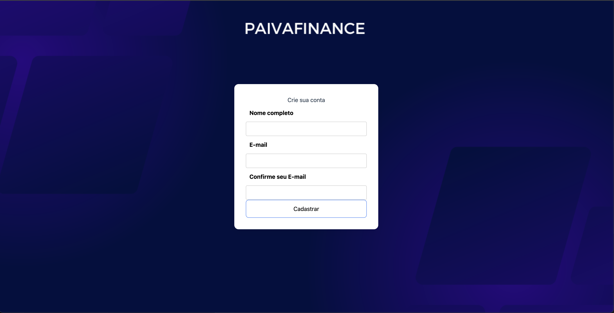
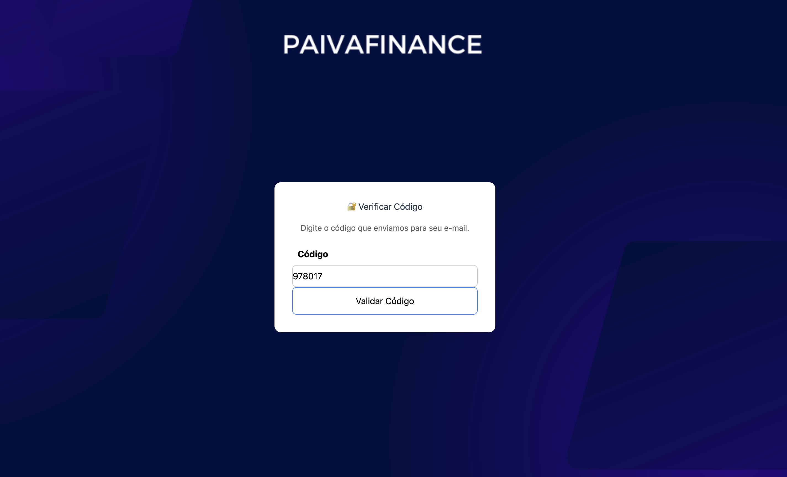
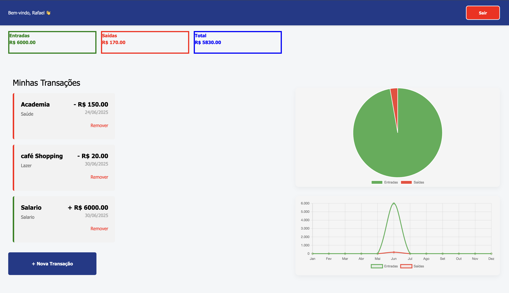
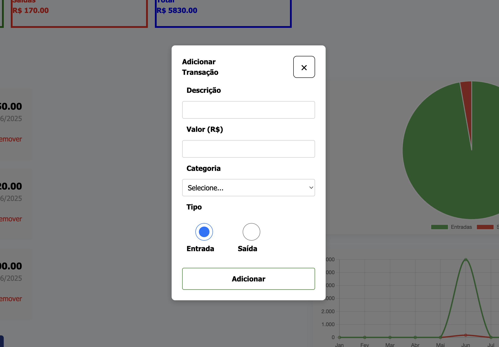

<h1 align="center">
Paiva Finance
</h1>

  <a href="#-tecnologias">Tecnologias</a>&nbsp;&nbsp;&nbsp;|&nbsp;&nbsp;&nbsp;
  <a href="#-projeto">Projeto</a>&nbsp;&nbsp;&nbsp;|&nbsp;&nbsp;&nbsp;

 

  

 

  
  
  
   
  
  

## 🚀 Tecnologias

Esse projeto foi desenvolvido com as seguintes tecnologias:

- HTML
- CSS
- JavaScript
- Git e GitHub
- Vue.js
- Node.js (Express.js)
- MongoDB Atlas (Mongoose)
- Chart.js (Graficos)
- Token JWT

## 💻 Projeto

o PaivaFinance é uma aplicação fullstack desenvolvida para ajudar os usuários a controlar suas finanças pessoais de forma simples, visual e eficiente. Com ele, é possível cadastrar entradas e saídas, visualizar o saldo total e acompanhar o histórico financeiro por meio de gráficos interativos em tempo real.

Feito com ♥ by Rafael Paiva :wave:
